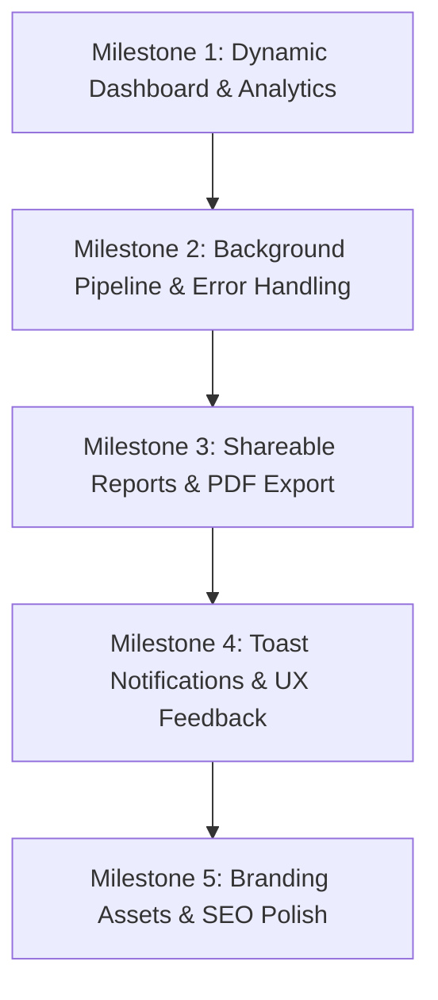

# 🚀 AuditHQ Production Readiness & Roadmap Plan

This document outlines the architecture, current state, and the systematic implementation roadmap to take **AuditHQ** from MVP to full production readiness.

---

## 📌 1. Current State Overview

- **Branding**: Renamed to **AuditHQ** across package metadata, UI navigation, landing page, and report exports.
- **Authentication**: Kinde Auth integration with route protection configured for both local development (`localhost:3000`) and production (`swiftaudithq.vercel.app`).
- **Database & ORM**: PostgreSQL (Neon Serverless) with Prisma 7, configured with graceful build-time client generation.
- **Audit Engine**: Google PageSpeed Insights (Lighthouse Cloud Engine) executed natively via Next.js `after()` API.
- **Report Dashboard**: Full Lighthouse breakdown (Core Web Vitals, Category Gauges, Opportunities, Network Payloads, Security, Diagnostics).

---

## 🎯 2. Next Milestones & Feature Roadmap

### 📊 Milestone 1: Dynamic Dashboard & Real Analytics (✅ Completed)
*Replace static placeholder data (`data.ts`) with live database calculations.*

- [x] **Dynamic Stats Overview Cards** (`components/dashboard/StatsOverviewCards.tsx`):
  - **Tests This Month**: Calculate count of tests performed by the user in the current billing cycle / month.
  - **Avg Performance Score**: Compute average Lighthouse performance score across all user audits.
  - **Active Sites / Monitored Domains**: Query unique count of user domains.
  - **Avg Load Time (LCP / FCP)**: Calculate mean Largest Contentful Paint across recent tests with trend indicators.
- [x] **Real Historical Performance Trends** (`components/dashboard/AnalyticsAndRecentTabs.tsx`):
  - Aggregate score timeline grouped by date for interactive visualization.
  - Compute live Core Web Vitals averages (LCP, FID/INP, CLS) across all user tests.
  - Generate dynamic recommendation highlights based on common audit opportunities.

---

### ⚡ Milestone 2: Background Task Pipeline & Resilience (✅ Execution Simplified)
*Ensure high reliability and zero dropped audits under heavy load or long execution times.*

- [x] **Native Serverless Background Execution (`after()`)**:
  - Direct execution via Next.js `after()` API without third-party queue overhead.
- [ ] **Robust Error States & Graceful Failures**:
  - Update `TestCard.tsx` and the report page with clear error badges (e.g. "DNS Unresolvable", "Timeout", "Rate Limited") if a test fails.
  - Add retry action trigger on failed tests.

---

### 🔗 Milestone 3: Shareable Reports & Export Capabilities (✅ Completed)
*Enable collaboration and reporting for client and team presentations.*

- [x] **Public Shareable Report URLs**:
  - Added dedicated `/report/[id]` public route allowing users to share read-only audit reports with clients and teammates without login requirements.
- [x] **PDF & CSV Export**:
  - Implemented single-click clean print & PDF export formatting (`@media print`).
  - Added CSV export functionality generating structured spreadsheets of category scores and Core Web Vitals.
  - Retained complete raw Lighthouse JSON export.

---

### 🔔 Milestone 4: Real-time User Feedback & Notifications
*Improve user experience during asynchronous audits.*

- [ ] **Toast Notification System**:
  - Integrate `sonner` or `react-hot-toast` for real-time alerts when tests are queued, completed, or failed.
- [ ] **Browser Notifications**:
  - Optional browser push notifications when long-running background audits complete while the user is on another tab.

---

### 🎨 Milestone 5: Brand Assets, SEO & Performance Polish
*Polish metadata, social previews, and asset delivery.*

- [ ] **Custom Brand Favicon & Logos**:
  - Replace default Next.js `favicon.ico` with AuditHQ SVG/PNG icon.
  - Add `apple-touch-icon.png` and web manifest icons.
- [ ] **OpenGraph & Twitter Card Metadata**:
  - Configure `app/layout.tsx` metadata with dynamic OpenGraph title, description, and preview banner image for social sharing.
- [ ] **Automated Performance Optimization**:
  - Optimize dynamic imports for heavy charting / tab components to maintain sub-100ms dashboard interaction times.

---

## 🛠️ Suggested Implementation Order

1. **Step 1**: Implement real database queries for Dashboard Overview Cards & Analytics Tab.
2. **Step 2**: Polish audit failure states and Inngest production connection.
3. **Step 3**: Add shareable public links and PDF export.
4. **Step 4**: Add toast notification feedback.
5. **Step 5**: Finalize branding assets, favicon, and SEO meta tags.
