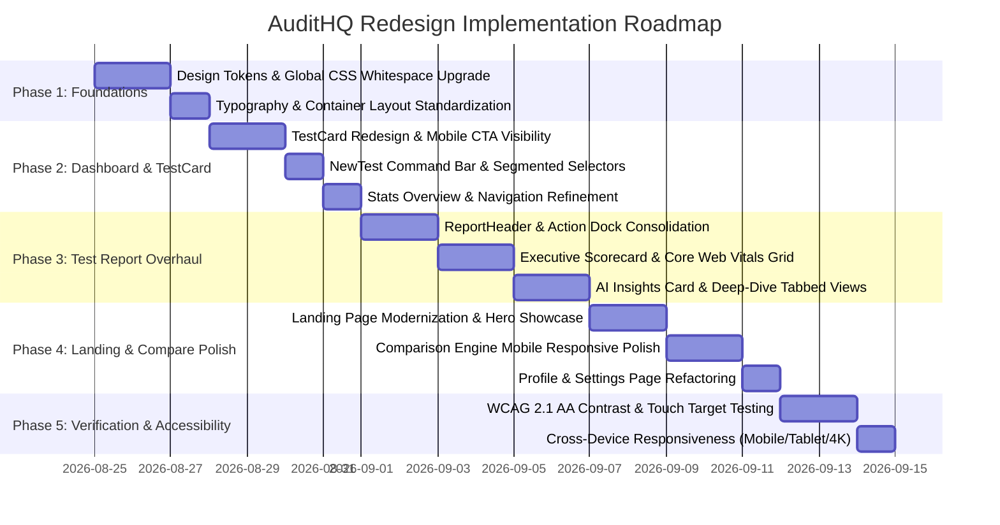

# 🎨 Product Design & Project Master Plan: Full UI/UX Redesign of AuditHQ

**Project**: AuditHQ Web Performance Intelligence Platform  
**Authors**: Senior Product Design & Technical Project Management Team  
**Status**: Ready for Implementation  
**Data Integrity**: 100% Retained (Same schema, database models, Lighthouse telemetry, and API contracts)  

---

## 1. Executive Summary & Design Vision

AuditHQ is a premier web performance audit suite delivering Lighthouse 12.0 diagnostics, Core Web Vitals tracking, AI-powered root cause reasoning, and audit comparison engine. 

While the underlying data engine and analytics are comprehensive, the current user interface suffers from **high visual density, claustrophobic layouts on mobile devices, low-contrast action targets, and insufficient whitespace**.

### Redesign Vision & Core Principles

```
   ┌────────────────────────┐     ┌────────────────────────┐     ┌────────────────────────┐
   │  Airy Spatial Rhythm   │     │ Progressive Disclosure │     │  Unambiguous Actions   │
   │  8pt Grid • Soft Radii │ ──> │ Overview -> Deep Dive  │ ──> │ 44px Touch Targets     │
   │  Balanced Whitespace   │     │ Clean Visual Hierarchy │     │ High Contrast Buttons  │
   └──┬─────────────────────┘     └────────────────────────┘     └────────────────────────┘
      │
      ▼
   ┌──────────────────────────────────────────────────────────────────────────────────────┐
   │ Modern SaaS Aesthetic: Glassmorphic Accents, Calibrated Neutrals, Crisp Typography  │
   └──────────────────────────────────────────────────────────────────────────────────────┘
```

1. **Airy Spatial Rhythm & Generous Whitespace**: Eradicate "box-in-a-box" nested borders. Replace heavy tinted grey containers with clean whitespace, soft 1px border dividers, and subtle elevation shadows.
2. **Progressive Disclosure (Calm the Density)**: Prevent cognitive overload on audit pages by providing a high-level **Executive Health Overview** first, with collapsible diagnostic drawers and tabbed deep-dives for granular technical data.
3. **Ergonomic, Unambiguous Touch Targets**: Guarantee that primary actions—especially **"View Report"**, **"Run Audit"**, **"Compare"**, and **"Export PDF"**—stand out immediately with prominent contrast, clear affordance, and minimum 44×44px mobile touch zones.
4. **Mobile-First Responsiveness**: Eliminate horizontal scrollbars, squashed multi-column grids, and multi-row navigation wrapping on viewports below 640px.

---

## 2. Comprehensive Audit of Design Issues (Root Cause Analysis)

### 2.1 Reported Issues (Detailed Diagnosis)

| Reported Issue | Root Cause in Codebase | User Impact |
| :--- | :--- | :--- |
| **1. Test Page is Too Busy & Dense** | All sections (`CategoryScoreRings`, `CoreWebVitalsGrid`, `AiInsightsCard`, `VisualExperience`, and `ReportTabs`) render stacked simultaneously with heavy border containers, dense progress bars, multiple colored badges, and raw monospace dumps. | SREs and executives experience cognitive fatigue; difficult to scan top performance bottlenecks quickly. |
| **2. "View Report" Button Not Visible on Tests (Worse on Mobile)** | In `TestCard.tsx`, the CTA is a 12px secondary text link at the very bottom with low contrast (`text-xs text-text-tertiary`). On mobile, stacked URL, metadata, and 4-metric grid push the link below the fold or make it look like non-interactive metadata. | Users struggle to navigate to the detailed report, missing the core platform workflow on mobile and tablet screens. |
| **3. App Feels Claustrophobic on Smaller Screens** | Nested background layers (`bg-surface-0` inside `bg-surface-1` with `p-2.5` and `gap-2.5`), forced 4-column metric grids, overflowing button rows in `ReportHeader.tsx`, and crowded radio chips in `NewTest.tsx`. | Interface feels cramped, cluttered, and overwhelming on screens $\le 768\text{px}$. |
| **4. Overall Need for More Whitespace** | Vertical margins (`space-y-3.5`, `py-6`) and inner container paddings are inconsistent and tight. Margins around card headers, score badges, and charts lack breathing room. | The UI lacks visual hierarchy, elegance, and breathing room typical of modern SaaS tools like Stripe, Vercel, or Linear. |

---

### 2.2 Additional Discovered Design Flaws Across All Pages

#### A. Global Design System & Typography
- **Monospace Overuse**: Monospace font (`font-mono`) is applied indiscriminately to headings, dates, and device tags instead of being reserved strictly for code tokens, telemetry values, and URLs. This creates visual clutter and reduces typographic legibility.
- **Harsh "Christmas Tree" Badge Colors**: High-saturation inline pills (`bg-[#e3fcf7] text-[#00875a]`, `bg-[#fff8e5] text-[#b76e00]`, `bg-[#ffebe6] text-[#de350b]`) are repeated across every card, gauge, and table row, overwhelming the viewer.
- **Dark Mode Border Contrast**: Dark mode uses opaque borders and solid surface fills (`#1e1b38`) with stark contrast against background, lacking subtle semi-transparent border tints (`border-border/60`).

#### B. Landing Page (`app/page.tsx`)
- **Static & Heavy Hero Card Preview**: The hero metric preview is a rigid, non-interactive block that looks like a raw data table rather than a dynamic product showcase.
- **Feature Cards Redundancy**: Feature grids use identical heavy card borders with no visual variation or interactive hover depth.
- **Inconsistent Call-to-Action Styling**: Primary CTA buttons vary in padding, border radius, and icon alignment across different sections.

#### C. Dashboard & Console Overview (`app/dashboard/page.tsx`)
- **Audit Command Bar (`NewTest.tsx`)**: Input URL, device selection, network preset, and submit button are crammed together. On mobile, the radio toggles wrap into tight rows with tiny clickable hitboxes.
- **KPI Stats Overview Cards (`StatsOverviewCards.tsx`)**: 4 cards with tight padding (`p-4.5`), redundant trend badges, and no visual separation between primary numbers and supporting labels.
- **Empty / Loading States**: Skeletons and empty states have generic grey boxes without helpful onboarding prompts or micro-illustrations.

#### D. Test Report Page (`app/dashboard/test/[id]` & `app/report/[id]`)
- **Header Action Bar Clutter (`ReportHeader.tsx`)**: 8–10 independent buttons/links (Back, Share, JSON, PDF Export with 3 format variants, Compare, Re-run, Live URL, and tags) wrap into 3–4 awkward lines on tablet and mobile.
- **Core Web Vitals Metric Cards (`CoreWebVitalsGrid.tsx`)**: 6 cards render with 5 pieces of information each (weight, score progress bar, target thresholds, descriptions, and values), creating an overwhelming wall of cards.
- **Accordion & Deep-Dive Tab Tables (`OpportunitiesTab.tsx`, `DiagnosticsTab.tsx`, `NetworkPayloadTab.tsx`)**: Dense tables overflow on mobile with tiny text (`text-[10px]`), lacking clean responsive list views or expandable details drawers.
- **Filmstrip & Screenshot Viewer (`VisualExperience.tsx`)**: Filmstrip thumbnails have small preview targets, and the full-page screenshot modal lacks smooth pinch-to-zoom or spacious mobile preview bounds.

#### E. Compare Engine Pages & Modal (`components/compare/*`)
- **Side-by-Side Table Overflow**: Comparison tables lock minimum widths that cause horizontal cutoffs on mobile screens without a clean toggle between "Side-by-Side" and "Stacked Diff" modes.
- **Floating Dock / Selector Modal**: Selection modal lists test cards in a tight dialog without search or quick filter capabilities.

#### F. Profile & Account Settings (`app/dashboard/profile/page.tsx`)
- **Fragmented Card Hierarchy**: Profile attributes, tier limits, and sign-out controls lack a cohesive settings layout with proper section descriptions and spacious form controls.

---

## 3. Design System Foundations: Modern SaaS Theme & Tokens

### 3.1 Spatial Grid & Layout Architecture

```css
/* Generous 8pt Spatial Rhythm */
--space-1: 0.25rem;  /* 4px  - Micro padding */
--space-2: 0.5rem;   /* 8px  - Compact gap */
--space-3: 0.75rem;  /* 12px - Element inner spacing */
--space-4: 1rem;     /* 16px - Standard gap */
--space-5: 1.25rem;  /* 20px - Card inner padding (mobile) */
--space-6: 1.5rem;   /* 24px - Card inner padding (desktop) */
--space-8: 2rem;     /* 32px - Section gap */
--space-10: 2.5rem;  /* 40px - Major block separation */
--space-12: 3rem;    /* 48px - Page section rhythm */
--space-16: 4rem;    /* 64px - Hero & Major page headers */
```

- **Container Max-Width**: `max-w-6xl` (1152px) for focused scannability on desktop, preventing content from stretching too wide on ultra-wide monitors.
- **Responsive Padding**: Standard page container padding: `px-4 sm:px-6 lg:px-8 py-8 sm:py-10 lg:py-12`.
- **Card Surface Padding**: Upgraded from `p-4.5` to `p-6 sm:p-7` with generous `gap-6` across grid items.

### 3.2 Typography & Hierarchy Rules

| Level | Desktop Size / Weight | Mobile Size / Weight | Font Family | Usage |
| :--- | :--- | :--- | :--- | :--- |
| **Display / Hero** | `text-4xl sm:text-5xl font-extrabold tracking-tight` | `text-3xl font-extrabold` | Inter / Sans | Landing page hero, composite score gauge |
| **Page Title (H1)** | `text-2xl sm:text-3xl font-bold tracking-tight` | `text-xl font-bold` | Inter / Sans | Dashboard welcome, Report header title |
| **Section Title (H2)**| `text-lg sm:text-xl font-semibold` | `text-base font-semibold` | Inter / Sans | Section headings, card group titles |
| **Card Title / Metric**| `text-sm font-semibold text-text-primary` | `text-xs font-semibold` | Inter / Sans | Metric names, audit titles |
| **Telemetry Values** | `text-2xl sm:text-3xl font-bold` | `text-xl font-bold` | JetBrains Mono | Numerical scores, millisecond metrics |
| **Body / Description**| `text-sm text-text-secondary leading-relaxed` | `text-xs leading-relaxed` | Inter / Sans | Explanations, AI insights, recommendations |
| **Metadata / Badges** | `text-xs font-medium` | `text-[11px]` | Inter / Sans | Timestamps, device chips, status indicators |

### 3.3 Refined Color & Contrast System

```
Light Mode Surfaces:
  --background: #f8fafc (Slate-50: Crisp, clean, modern backdrop)
  --surface-0:   #ffffff (Pure white cards with subtle border & shadow)
  --surface-1:   #f1f5f9 (Slate-100: Soft badge fills & subtle table headers)
  --surface-2:   #e2e8f0 (Slate-200: Dividers & hover states)
  --border:      #e2e8f0 (Clean 1px stroke, 0 harsh outlines)

Dark Mode Surfaces:
  --background: #090d16 (Deep obsidian / slate navy)
  --surface-0:   #0f172a (Slate-900: High-contrast card surfaces)
  --surface-1:   #1e293b (Slate-800: Inset panels & badge backgrounds)
  --surface-2:   #334155 (Slate-700: Hover states)
  --border:      rgba(255, 255, 255, 0.08) (Subtle translucent border)

Brand & Score Semantics (Balanced, accessible contrast):
  --brand-600:      #4f46e5 (Indigo-600: Electric, premium SaaS primary)
  --score-good:     #059669 (Emerald-600: Clear positive signal)
  --score-warn:     #d97706 (Amber-600: Clear warning signal)
  --score-poor:     #dc2626 (Rose-600: Distinct failure signal)
```

---

## 4. Detailed Page-by-Page Redesign Specifications

### 4.1 Dashboard & Audit Console (`/dashboard`)

```
┌──────────────────────────────────────────────────────────────────────────┐
│  DashboardNav (Sticky 64px - Brand Logo, Console/Profile, User Menu)     │
├──────────────────────────────────────────────────────────────────────────┤
│                                                                          │
│  [ Welcome Banner ]  Good afternoon, Alex • 24 audits run this month    │
│                                                                          │
│  ┌──────────────┐ ┌──────────────┐ ┌──────────────┐ ┌──────────────┐   │
│  │ Total Audits │ │ Avg Perf     │ │ Healthy Sites│ │ Fast LCP     │   │
│  │ 128          │ │ 92/100       │ │ 94%          │ │ 1.2s avg     │   │
│  └──────────────┘ └──────────────┘ └──────────────┘ └──────────────┘   │
│                                                                          │
│  ┌────────────────────────────────────────────────────────────────────┐  │
│  │ ⚡ Run Instant Lighthouse Cloud Audit                              │  │
│  │ [ Enter website URL: https://example.com... ]  [ 📱/💻 ] [ Run ]  │  │
│  └────────────────────────────────────────────────────────────────────┘  │
│                                                                          │
│  [ All Audits (12) ]  [ Performance Trends ]  [ ⚖️ Compare Selected ]    │
│                                                                          │
│  ┌────────────────────────────────────────────────────────────────────┐  │
│  │ 🌐 https://shopify.com/storefront                                  │  │
│  │ 2 mins ago • Desktop • 4G Fast Throttling                          │  │
│  │                                                                    │  │
│  │ [ FCP: 0.8s ]  [ LCP: 1.4s ]  [ TBT: 40ms ]  [ CLS: 0.01 ]        │  │
│  │                                                                    │  │
│  │ ┌──────────────┐                               ┌─────────────────┐ │  │
│  │ │ Score: 98/100│                               │ [View Report →] │ │  │
│  │ └──────────────┘                               └─────────────────┘ │  │
│  └────────────────────────────────────────────────────────────────────┘  │
└──────────────────────────────────────────────────────────────────────────┘
```

#### Key Improvements for Dashboard:
1. **Redesigned `TestCard.tsx` (Solves Issue #2 & #3)**:
   - **Prominent Primary CTA Button**: Replace the hidden text link with a full-width or dedicated primary button:
     `<Button className="w-full sm:w-auto h-10 px-5 bg-brand-600 hover:bg-brand-700 text-white font-semibold text-xs rounded-xl shadow-xs"> View Full Report → </Button>`
   - **Score Badge & Metric Clarity**: Place the composite score in a crisp, clean pill at the top-right on desktop, and top-right on mobile next to the URL.
   - **Spacious Metric Pills**: Render FCP, LCP, TBT, and CLS as uncluttered, light-filled pills with clear labels and generous spacing.
   - **Mobile Layout**: On mobile, the card organizes into a clear vertical rhythm: 
     1) URL & Status Badge $\rightarrow$ 2) Timestamp & Device $\rightarrow$ 3) 2x2 Metric Grid with breathing room $\rightarrow$ 4) Dedicated full-width "View Full Report" button (44px height).

2. **Redesigned Audit Command Bar (`NewTest.tsx`)**:
   - Elevated glassmorphic card with generous padding (`p-6 sm:p-8`).
   - Clean, large URL input with leading search/globe icon and keyboard shortcut badge (`⌘K`).
   - Device and network selectors designed as modern segmented pill tabs rather than cluttered dropdowns.
   - High-contrast **"Run Audit"** button with loading spinner state and micro-animation.

3. **Redesigned `StatsOverviewCards.tsx`**:
   - 4 spacious KPI cards with micro trend indicators and clean typographic contrast between metric titles and large numbers.

4. **Redesigned `AnalyticsAndRecentTabs.tsx`**:
   - Smooth animated active tab indicator.
   - Integrated search & filter bar (Filter by Domain, Device, or Status).
   - "Compare Audits" action button visible as a floating toolbar when tests are selected.

---

### 4.2 Single Test Report Page (`/dashboard/test/[id]` & `/report/[id]`)

#### Layout Restructuring (Solves Issue #1: Busy & Dense Test Page)

```
┌──────────────────────────────────────────────────────────────────────────┐
│  ReportHeader (Spacious, Clean Header with Structured Action Dock)       │
│  ← Back to Dashboard   |   https://myapp.com/checkout   |  Live URL ↗    │
│  [ 📅 Aug 24, 2026 ]  [ 💻 Desktop ]  [ ⚡ 4G Fast ]                      │
│                                                                          │
│  [ ⚖️ Compare ]   [ 🔗 Share ]   [ 📄 Export PDF ▾ ]   [ 🔄 Re-run ]     │
├──────────────────────────────────────────────────────────────────────────┤
│                                                                          │
│  1. EXECUTIVE HEALTH HERO (Composite Score + 4 Core Categories)          │
│  ┌─────────────────────────┬──────────────────────────────────────────┐  │
│  │ ⚡ Performance: 96/100  │  ♿ A11y: 100   🛡️ Best: 96   🔍 SEO: 100 │  │
│  │ Speed Verdict: Optimal  │  (Clean radial rings with breathing room)│  │
│  └─────────────────────────┴──────────────────────────────────────────┘  │
│                                                                          │
│  2. CORE WEB VITALS SPOTLIGHT (High-Level Grid with Clean Contrast)      │
│  ┌──────────────┐ ┌──────────────┐ ┌──────────────┐ ┌──────────────┐   │
│  │ LCP • 1.2s   │ │ FCP • 0.8s   │ │ TBT • 50ms   │ │ CLS • 0.00   │   │
│  │ 🟢 Good      │ │ 🟢 Good      │ │ 🟢 Good      │ │ 🟢 Good      │   │
│  └──────────────┘ └──────────────┘ └──────────────┘ └──────────────┘   │
│                                                                          │
│  3. AI PERFORMANCE SUMMARY (Collapsible Executive Brief)                 │
│  ┌────────────────────────────────────────────────────────────────────┐  │
│  │ ✨ Gemini Executive Summary & Top 3 Actionable Fixes               │  │
│  └────────────────────────────────────────────────────────────────────┘  │
│                                                                          │
│  4. PROGRESSIVE DEEP-DIVE TABS (Organized Technical Drilldown)           │
│  [ ⚡ Opportunities (3) ] [ 🔬 Diagnostics ] [ 📦 Payloads ] [ 🛡️ Sec ]  │
│  ┌────────────────────────────────────────────────────────────────────┐  │
│  │ Clean accordion with expandable code snippets, savings, & resources│  │
│  └────────────────────────────────────────────────────────────────────┘  │
│                                                                          │
│  5. VISUAL RENDERING TIMELINE (Filmstrip Scrubber & Preview Modal)       │
│  ┌────────────────────────────────────────────────────────────────────┐  │
│  │ Frame-by-frame visual progression (0ms -> 1200ms) with zoom modal  │  │
│  └────────────────────────────────────────────────────────────────────┘  │
└──────────────────────────────────────────────────────────────────────────┘
```

#### Key Improvements for Test Report:
1. **Simplified & Consolidated Action Header (`ReportHeader.tsx`)**:
   - Group actions into a unified secondary button group on desktop:
     - Primary: **Export PDF** (Dropdown with Clean Preview)
     - Secondary: **Compare**, **Share Link**, **Re-run Audit**
     - Tertiary / Overflow: **Export Raw JSON** inside a tidy `•••` dropdown menu.
   - On mobile, actions collapse into a sticky bottom or top floating action bar, preventing 4 rows of wrapping buttons.

2. **Executive Health Hero (`CategoryScoreRings.tsx`)**:
   - Unify the 4 separate score cards into an elegant, unified **Executive Scorecard** banner.
   - Display the primary Performance Score prominently on the left with a dynamic radial gauge, flanked by Accessibility, Best Practices, and SEO in clean, spacious sub-gauges.
   - Remove redundant inline warning pills to reduce visual noise.

3. **Clean Core Web Vitals Spotlight (`CoreWebVitalsGrid.tsx`)**:
   - Modernize metric cards with generous padding (`p-6`), clear large values (`text-2xl font-mono`), and simplified rating pills (`Good`, `Needs Work`, `Poor`).
   - Move detailed technical definitions into an interactive tooltip or click-to-expand drawer to eliminate clutter.

4. **AI Performance Insights (`AiInsightsCard.tsx`)**:
   - Elegant glowing border accent (`border-brand-500/20 bg-linear-to-b from-brand-50/50 to-surface-0`).
   - Clean bullet points for top actionable fixes with estimated millisecond savings chips.

5. **Deep Dive Tabs (`ReportTabs.tsx`, `OpportunitiesTab.tsx`, `DiagnosticsTab.tsx`)**:
   - Upgrade tabs from dense tables to modern cards with clear status pills and expandable item drawers.
   - Monospace code snippets styled in dark terminal blocks with one-click **"Copy Fix"** buttons.

---

### 4.3 Landing Page Redesign (`app/page.tsx`)

1. **Hero Section Modernization**:
   - Generous top/bottom whitespace (`pt-24 pb-32`).
   - Large, punchy headline with dynamic gradient text accent.
   - Interactive live performance preview card with subtle glassmorphic backdrop glow.
   - Clear, dual CTA: Primary "Audit Your Site Free" + Secondary "View Live Sample Report".
2. **Feature Grid & How-It-Works**:
   - 3-column feature grid with modern icon badges, subtle hover elevation (`hover:-translate-y-1 hover:shadow-lg`), and generous inner padding (`p-8`).
   - Step-by-step visual roadmap (1. Enter URL $\rightarrow$ 2. Cloud Lighthouse Emulation $\rightarrow$ 3. AI Root Cause Diagnosis $\rightarrow$ 4. Regression Tracking).
3. **Footer**:
   - Clean, modern footer with product links, documentation references, and copyright info.

---

### 4.4 Audit Comparison Pages (`app/dashboard/compare/page.tsx` & `app/compare/page.tsx`)

1. **Compare Header**:
   - Clear Base (Audit A) $\leftrightarrows$ Target (Audit B) header with a prominent **Swap** button and date/device badges.
2. **Executive Delta Scorecard**:
   - Giant net score change badge ($\Delta +12$ or $\Delta -8$) with clear textual verdict (*"Significant Speed Improvement"*).
3. **Responsive Side-by-Side CWV Delta Grid**:
   - Metric cards comparing Base $\rightarrow$ Target with clear directional arrows and color-coded delta chips ($-\text{340ms LCP}$).
   - On mobile, automatically stacks Base and Target vertically with clear dividers to prevent cramped horizontal squishing.
4. **Synchronized Visual Filmstrip**:
   - Timeline slider with synchronized frame matching and visual change indicators.

---

### 4.5 Profile & Account Settings (`app/dashboard/profile/page.tsx`)

1. **Structured Settings Sections**:
   - **User Profile & Credentials**: Avatar, name, email, and authentication provider.
   - **Audit Usage & Quota**: Clean visual progress bar (e.g., *24 / 100 monthly audits used*).
   - **Theme & Display Preferences**: Light / Dark / System mode switcher.
   - **Sign Out**: Clear, safe sign-out button with confirmation state.

---

## 5. Component Refactoring & Architecture Matrix

| Component File | Current Flaws | Redesign Blueprint | Priority |
| :--- | :--- | :--- | :--- |
| [TestCard.tsx](file:///c:/dev/zynex/components/dashboard/TestCard.tsx) | "View Report" button buried as tiny 12px text; cramped 4-column metric grid on mobile; dense border nesting. | Add dedicated prominent primary button; clean 2x2 mobile metric grid; high-contrast score badge; 44px tap target. | 🔴 High |
| [NewTest.tsx](file:///c:/dev/zynex/components/dashboard/NewTest.tsx) | Cramped radio chips; small clickable hitboxes; input field lacks visual prominence. | Segmented pill tabs for Device/Network; large URL input with keyboard hint; prominent "Start Audit" CTA. | 🔴 High |
| [RecentTests.tsx](file:///c:/dev/zynex/components/dashboard/RecentTests.tsx) | Tight card spacing (`space-y-3.5`); comparison toolbar crowded. | Spacious vertical list (`space-y-5`); floating compare dock with smooth entrance animation. | 🔴 High |
| [ReportHeader.tsx](file:///c:/dev/zynex/components/report/ReportHeader.tsx) | 8+ buttons wrap into 3-4 lines on mobile; cluttered export dropdown. | Group into consolidated Action Dock; PDF Export dropdown; clean mobile sticky bar. | 🔴 High |
| [CoreWebVitalsGrid.tsx](file:///c:/dev/zynex/components/report/CoreWebVitalsGrid.tsx) | 6 dense cards with progress bars and descriptions competing for attention. | Refined cards with large telemetry values, simplified rating badges, and collapsible diagnostic detail. | 🟡 Medium |
| [CategoryScoreRings.tsx](file:///c:/dev/zynex/components/report/CategoryScoreRings.tsx) | 4 separate boxed gauges creating visual fragmentation. | Unified Executive Health scorecard with primary Performance ring and 3 supporting gauges. | 🟡 Medium |
| [AiInsightsCard.tsx](file:///c:/dev/zynex/components/report/AiInsightsCard.tsx) | Monolithic text container with dense chip list. | Glassmorphic card with tabbed action priorities, estimated ms savings badges, and copyable snippets. | 🟡 Medium |
| [ReportTabs.tsx](file:///c:/dev/zynex/components/report/ReportTabs.tsx) | Heavy tab headers; sub-tab tables overflow on mobile. | Modern segmented tab bar; mobile scroll container; responsive card lists for audits & opportunities. | 🟡 Medium |
| [DashboardNav.tsx](file:///c:/dev/zynex/components/dashboard/DashboardNav.tsx) | Mobile avatar and nav links wrap tightly on small screens. | Clean 64px sticky bar with responsive slide-over menu or compact profile popover. | 🟡 Medium |
| [page.tsx (Landing)](file:///c:/dev/zynex/app/page.tsx) | Static hero preview, heavy borders, tight section rhythm. | Spacious modern hero with dynamic preview, gradient accents, and refined feature cards. | 🟢 Polish |
| [globals.css](file:///c:/dev/zynex/app/globals.css) | Low dark mode border contrasts, tight radii, harsh badge fills. | Modernized design tokens, generous radii (`rounded-2xl`), subtle shadows, accessible score palette. | 🔴 High |

---

## 6. Implementation Phases & Project Roadmap



### Phase 1: Design Tokens & Layout Foundations (`app/globals.css`, `app/layout.tsx`)
- Update CSS variables for spacious padding (`--space-*`), modern surface colors (`--surface-0`, `--surface-1`), and accessible score badge shades.
- Set max-width constraints and standard container padding across desktop and mobile.
- Remove harsh solid outlines in favor of subtle translucent borders (`border-border/80`).

### Phase 2: Dashboard & Test Card Redesign (`components/dashboard/*`)
- **Refactor `TestCard.tsx`**:
  - Implement prominent, high-contrast **"View Full Report →"** button (`bg-brand-600 hover:bg-brand-700 text-white rounded-xl min-h-[44px]`).
  - Restructure mobile layout with clean 2x2 metric pills and prominent score badge.
- **Refactor `NewTest.tsx`**:
  - Create a modern, floating audit command bar with segmented pill controls for Device/Network selection.
- **Refactor `StatsOverviewCards.tsx` & `DashboardNav.tsx`**:
  - Implement airy card layout and sleek responsive navigation bar.

### Phase 3: Test Report Page Overhaul (`components/report/*`, `app/dashboard/test/[id]`, `app/report/[id]`)
- **Refactor `ReportHeader.tsx`**:
  - Build a clean, responsive Action Dock with single consolidated PDF Export dropdown, clean Compare trigger, and compact mobile layout.
- **Refactor `CategoryScoreRings.tsx` & `CoreWebVitalsGrid.tsx`**:
  - Create the unified Executive Scorecard and clean, non-cluttered metric cards.
- **Refactor `AiInsightsCard.tsx` & `ReportTabs.tsx`**:
  - Enhance readability with clean typography, collapsible drawers, and responsive payload tables.

### Phase 4: Landing Page, Compare & Profile Polish (`app/page.tsx`, `components/compare/*`, `app/dashboard/profile/*`)
- Redesign Landing Page with modern hero showcase, gradient accents, and balanced whitespace.
- Optimize Compare views (`/compare` and `/dashboard/compare`) for seamless mobile stacking.
- Polish Profile & Settings page.

### Phase 5: Verification, Responsive Testing & Quality Assurance
- Test across mobile viewports (375px, 414px), tablet viewports (768px, 1024px), and desktop viewports (1440px, 1920px).
- Verify all interactive elements meet WCAG 2.1 AA touch target standards ($\ge 44 \times 44\text{px}$).
- Ensure zero breaking changes to database schemas, API routes, and Lighthouse parser outputs.

---

## 7. Verification & Acceptance Criteria

### Automated & Build Quality
- [ ] `npm run build` succeeds with zero TypeScript or JSX compile errors.
- [ ] No regression in SWR data caching, Zustand store synchronization, or API fetcher logic.

### UX & Visual Quality
- [ ] **Test Card "View Report" Visibility**: The "View Full Report" button is prominently visible on all screen sizes ($\ge 375\text{px}$ to $4\text{K}$) with high contrast and $\ge 44\text{px}$ tap height.
- [ ] **Mobile Breathing Room**: All pages have at least 16px lateral padding and comfortable vertical spacing between sections; no horizontal scroll traps.
- [ ] **Test Page Scannability**: Test report page presents an instant executive summary above the fold without overwhelming the user with raw data dumps.
- [ ] **Contrast & Accessibility**: All text and badge elements comply with WCAG 2.1 AA contrast ratios ($\ge 4.5:1$ for normal text, $\ge 3:1$ for large text/badges).
- [ ] **Theme Support**: Seamless, beautiful visual harmony in both Light and Dark modes.
