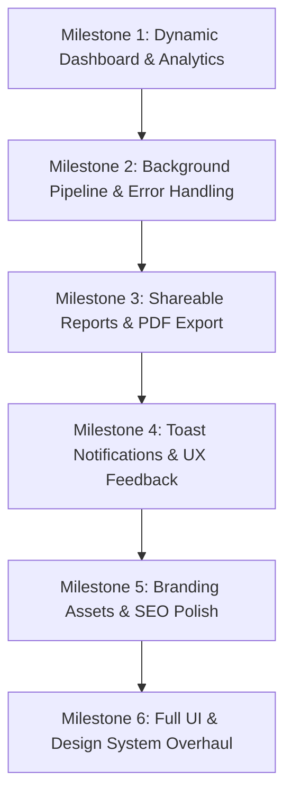

# 🚀 AuditHQ Production Readiness & Design Architecture

This document defines the production engineering roadmap, product vision, and design specifications for **AuditHQ** — an autonomous web performance intelligence platform.

---

## 📌 1. Project Overview & Architecture

- **Branding**: **AuditHQ** across all metadata, UI surfaces, and export engines.
- **Authentication**: Kinde Auth integration with route protection configured for development (`localhost:3000`) and production (`swiftaudithq.vercel.app`).
- **Database & ORM**: PostgreSQL on Neon Serverless with Prisma 7 and build-time client generation.
- **Audit Engine**: Google PageSpeed Insights (Lighthouse 12.0 Engine) executed asynchronously via Next.js `after()` API.
- **Reporting Suite**: Executive HUD, Core Web Vitals diagnostics, network payload distribution, security posture checks, visual filmstrip timeline, and client-side vector PDF generation.

---

## 🎯 2. Product Roadmap & Milestones



---

### 📊 Milestone 1: Dynamic Dashboard & Analytics (✅ Completed)
- [x] **Dynamic Stats Overview Cards** (`components/dashboard/StatsOverviewCards.tsx`):
  - **Tests This Month**: Real monthly quota tracker with segmented progress indicator.
  - **Avg Performance Score**: Live user mean score across all completed tests with delta indicator.
  - **Active Domains**: Count of unique monitored domains.
  - **Avg Load Time (LCP)**: Mean Largest Contentful Paint with Google threshold benchmark.
- [x] **Historical Performance Trajectory** (`components/dashboard/AnalyticsAndRecentTabs.tsx` & `PerformanceTrajectoryChart.tsx`):
  - Continuous SVG curve with gradient area fill and dynamic threshold reference lines (90 / 50 / 0).
  - Live Core Web Vitals aggregates (LCP, TBT, CLS) compared against Google thresholds.
  - Actionable optimization priorities derived directly from live database metrics.

---

### ⚡ Milestone 2: Background Task Pipeline (✅ Completed)
- [x] **Serverless Background Execution**:
  - Direct asynchronous background execution via Next.js `after()` API.
- [x] **Failure Resilience**:
  - Clear error badges and diagnostics when URLs fail DNS resolution or timeout.

---

### 🔗 Milestone 3: Shareable Reports & Export Engine (✅ Completed)
- [x] **Public Shareable Report URLs** (`app/report/[id]/page.tsx`):
  - Public read-only report view with OpenGraph and Twitter card previews.
- [x] **PDF & JSON Export**:
  - Structured client-side `jsPDF` report generation.
  - Raw Lighthouse JSON export.

---

### 🔔 Milestone 4: Real-time Feedback & Notifications (✅ Completed)
- [x] **Toast Notification System (`sonner`)**:
  - `toast.loading()` upon audit initiation with persistent spinner.
  - `toast.success()` on completion displaying performance score and report link.
  - `toast.error()` on failure with diagnostic messages.

---

### 🎨 Milestone 5: Brand Assets, SEO & Performance (✅ Completed)
- [x] **Brand Assets**: Custom lightning bolt favicon (`app/icon.jpg`) and Apple touch icon (`public/apple-touch-icon.jpg`).
- [x] **Metadata & SEO**: OpenGraph, Twitter cards, meta titles, descriptions, and keywords.
- [x] **Dynamic Code Splitting**: Heavy report components lazily loaded via `next/dynamic` (`ssr: false`).

---

# 🎨 Milestone 6: Design System & Component Overhaul

---

## 1. Design System Foundation (✅ Completed)

### 1.1 Typography System
| Role | Font | Weight | Purpose |
|---|---|---|---|
| **Display & UI Headings** | `Inter` | 600, 700, 800, 900 | Hero sections, dashboard cards, navigation |
| **Body & Prose** | `Inter` | 400, 500, 600 | Informational copy, descriptions, table labels |
| **Numerical Telemetry** | `JetBrains Mono` | 500, 600, 700 | Performance scores, timing values, byte sizes, code |

### 1.2 Semantic Color Tokens
```css
/* Brand Scale */
--brand-50:  hsl(221, 100%, 97%);
--brand-100: hsl(221, 96%,  93%);
--brand-200: hsl(221, 91%,  84%);
--brand-500: hsl(221, 83%,  58%);
--brand-600: hsl(221, 83%,  53%);
--brand-700: hsl(221, 80%,  45%);
--brand-900: hsl(221, 72%,  22%);

/* Semantic Score Scales */
--score-good:    hsl(142, 71%, 40%);   /* ≥90: Lighthouse Green */
--score-warn:    hsl(32,  95%, 44%);   /* 50–89: Amber */
--score-poor:    hsl(0,   72%, 51%);   /* <50: Rose / Red */
--score-neutral: hsl(215, 20%, 65%);   /* Pending / N/A */

/* Neutral Surfaces */
--surface-0:   hsl(0, 0%, 100%);      /* Card background */
--surface-1:   hsl(220, 14%, 98%);    /* Page background */
--surface-2:   hsl(220, 13%, 95%);    /* Dividers & table stripes */
--surface-3:   hsl(215, 14%, 89%);    /* Borders */
--text-primary:   hsl(222, 47%, 11%); /* Primary text */
--text-secondary: hsl(215, 16%, 47%); /* Muted secondary text */
--text-tertiary:  hsl(215, 16%, 65%); /* Micro labels & placeholders */
```

---

## 2. Page & Component Architecture

### 2.1 Landing Page (`app/page.tsx`) (✅ Completed)
- **Dark Atmospheric Hero**: `bg-[hsl(222,47%,8%)]` with animated CSS gradient meshes (`.animate-mesh-1`, `.animate-mesh-2`).
- **Feature Bento Grid**: 3-column interactive bento grid showcasing real-time engine telemetry.
- **Workflow Timeline**: 3-step connected horizontal progression bar.

---

### 2.2 Dashboard Navigation (`components/dashboard/DashboardNav.tsx`) (✅ Completed)
- Compact `h-14` header bar with active indicator underline.
- Flat brand logo, profile pill, and clean logout trigger.

---

### 2.3 Dashboard Stats Cards (`components/dashboard/StatsOverviewCards.tsx`) (✅ Completed)
- Segmented quota progress bar for monthly test tracking.
- `JetBrains Mono` bold values with delta pills.
- LCP threshold indicator with 3-tier status bar.

---

### 2.4 New Test Command Bar (`components/dashboard/NewTest.tsx`) (✅ Completed)
- Command-bar pattern with focused brand ring.
- Segmented pill toggles for **Desktop / Mobile** and **Direct / 4G / 3G** network throttling.
- Primary submit action with animated loading state.

---

### 2.5 Audited Domain Cards (`components/dashboard/TestCard.tsx`) (✅ Completed)
- Clean uniform borders (`border border-surface-3 hover:border-brand-200 hover:shadow-sm`).
- `JetBrains Mono` metric badges (FCP, LCP, TBT, CLS).
- Dedicated score status pill and hover-animated report link.

---

### 2.6 Analytics & Trajectory Chart (`components/dashboard/AnalyticsAndRecentTabs.tsx`) (✅ Completed)
- **Interactive Bézier Curve Chart**: Dynamic SVG chart with threshold guidelines (100 / 90 / 50 / 0), gradient fill, and interactive hover tooltip cards.
- **Aggregated Core Web Vitals Strip**: 3-tier target comparison cards with visual threshold bars.
- **Actionable Optimization Priorities**: Prioritized remediation advice derived from live data.

---

### 2.7 Executive Report Header (`components/report/ReportHeader.tsx`) (✅ Completed)
- **Obsidian Header Band**: `bg-[hsl(222,47%,8%)]` canvas with ambient radial lighting.
- **Endpoint Telemetry**: Monospace label `AUDITED ENDPOINT`, truncated URL with external preview, and environment chips.
- **Action Button Matrix**: Solid primary **Download PDF** button, frosted outline pills for **Share** and **JSON**, and contextual navigation.

---

### 2.8 Executive Performance HUD (`components/report/CategoryScoreRings.tsx` & `ScoreGauge.tsx`) (✅ Completed)
- **Composite Index Bar**: Executive banner calculating the 4-pillar average (`Composite Index: XX/100`) alongside an active legend.
- **Conic Radial Gauges**: Dual-track SVG arcs with ambient backlighting halos (`#10b981`, `#f59e0b`, `#ef4444`).
- **Crisp Typography**: Bold `text-4xl/5xl font-sans font-black` numerical score with uppercase `/ 100` subtext and industry benchmark percentiles (`Top 5% Web Benchmark`, `Standard Range`, `Below P75 Target`).

---

### 2.9 Core Web Vitals & Diagnostic Matrix (`components/report/CoreWebVitalsGrid.tsx`) (✅ Completed)
- **Clean Numerical Formatting**: Clean separation of numerical values from units (`0.4 s`, `0 ms`, `0.004`), eliminating unformatted string leaks.
- **Continuous 3-Zone Spectrum Bar**: Multi-gradient target spectrum `[Good | Needs Work | Poor]` with an animated indicator pin showing the exact measured position.
- **Google Core Vital Badging**: Clear differentiation between primary search ranking signals (LCP, TBT, CLS) and diagnostic timings (FCP, SI, TTFB).
- **SEO Weight & User Impact**: Plain-English real-world explanation for each metric with official Google Lighthouse algorithm weights (25%, 30%, 10%).

---

### 2.10 Tabbed Deep-Dives (`components/report/ReportTabs.tsx`) (✅ Completed)
- **2.10.1 Opportunities & Savings Drawer (`components/report/OpportunitiesTab.tsx`)**: Multi-state impact beacons (High/Medium/Low), dual savings badges (`Save ~X ms` / `Save ~X KB`), and expandable offender tables.
- **2.10.2 Network & Payload Intelligence (`components/report/NetworkPayloadTab.tsx`)**: Normalized bandwidth distribution bar and third-party vendor script blocker table.
- **2.10.3 Accessibility & SEO Inspector (`components/report/AuditsListTab.tsx`)**: Dual-pane selector with syntax-highlighted offending DOM node code blocks.
- **2.10.4 Security Posture Scorecard (`components/report/SecurityTab.tsx`)**: Live compliance counter and HTTPS/TLS/CSP verification cards.
- **2.10.5 Filmstrip Visual Experience (`components/report/VisualExperience.tsx`)**: Chronological screenshot frame reel and full-resolution lightbox viewer.

---

### 2.11 Public Report Conversion Funnel (`app/report/[id]/page.tsx`) (✅ Completed)
- **Top Announcement Ribbon**: `Public AuditHQ Snapshot · Read-Only View` with `Run Free Audit` action.
- **Mobile Sticky Action Strip**: Frosted bottom conversion bar with a 1-tap `Run Free Audit →` CTA.

---

## 3. Executive PDF Document Generation (`lib/generate-report-pdf.ts`) (✅ Completed)

- **Page Geometry**: Standard A4 document format with 14mm margins.
- **Header Band**: `#0f172a` executive band with `⚡ AuditHQ` brandmark and target metadata.
- **Pure Vector Radial Arcs**: Custom Bezier circular gauge arcs generated directly in vector geometry.
- **Core Web Vitals Benchmark Table**: Structured table with metric names, measured values, Google targets, and SEO impact.
- **2-Column Priorities Matrix**: *Passed Core Audits* vs *Top 3 Optimization Priorities*.
- **Executive Footer**: Document verification fingerprint and page numbering (`Page X of Y`).

---

## 4. Quality Standards & Verification Checklist

| Metric | Target | Status |
|---|---|---|
| **TypeScript Compilation** | 0 Errors | ✅ Verified |
| **Icons Standard** | Zero AI-style Sparkles icons; semantic Lucide icons | ✅ Verified |
| **Typography Integrity** | Inter for UI / JetBrains Mono for telemetry | ✅ Verified |
| **Responsive Layout** | Zero horizontal overflow on mobile & desktop | ✅ Verified |
| **Performance** | Code-split dynamic imports (`ssr: false`) for heavy report views | ✅ Verified |
