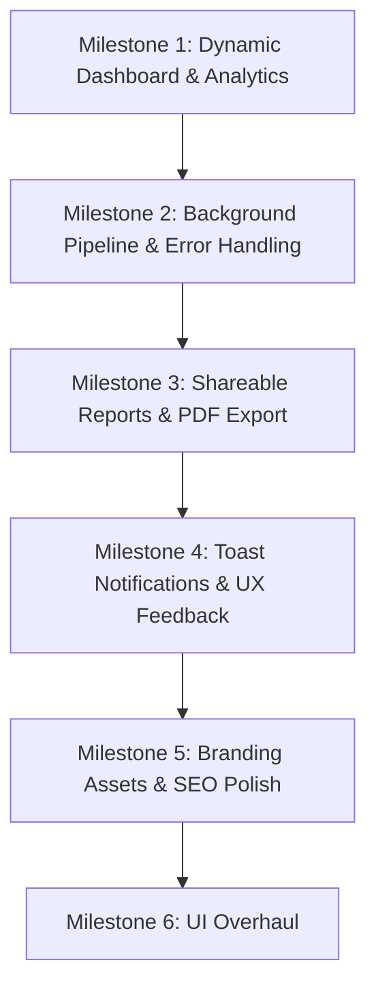

# 🚀 AuditHQ Production Readiness & Roadmap Plan

This document outlines the architecture, current state, and the systematic implementation roadmap to take **AuditHQ** from MVP to full production readiness.

---

## 📌 1. Current State Overview

- **Branding**: Renamed to **AuditHQ** across package metadata, UI navigation, landing page, and report exports.
- **Authentication**: Kinde Auth integration with route protection configured for both local development (`localhost:3000`) and production (`swiftaudithq.vercel.app`).
- **Database & ORM**: PostgreSQL (Neon Serverless) with Prisma 7, configured with graceful build-time client generation.
- **Audit Engine**: Google PageSpeed Insights (Lighthouse Cloud Engine) executed natively via Next.js `after()` API.
- **Report Dashboard**: Full Lighthouse breakdown (Core Web Vitals, Category Gauges, Opportunities, Network Payloads, Security, Diagnostics).

---

## 🎯 2. Next Milestones & Feature Roadmap

### 📊 Milestone 1: Dynamic Dashboard & Real Analytics (✅ Completed)
*Replace static placeholder data (`data.ts`) with live database calculations.*

- [x] **Dynamic Stats Overview Cards** (`components/dashboard/StatsOverviewCards.tsx`):
  - **Tests This Month**: Calculate count of tests performed by the user in the current billing cycle / month.
  - **Avg Performance Score**: Compute average Lighthouse performance score across all user audits.
  - **Active Sites / Monitored Domains**: Query unique count of user domains.
  - **Avg Load Time (LCP / FCP)**: Calculate mean Largest Contentful Paint across recent tests with trend indicators.
- [x] **Real Historical Performance Trends** (`components/dashboard/AnalyticsAndRecentTabs.tsx`):
  - Aggregate score timeline grouped by date for interactive visualization.
  - Compute live Core Web Vitals averages (LCP, FID/INP, CLS) across all user tests.
  - Generate dynamic recommendation highlights based on common audit opportunities.

---

### ⚡ Milestone 2: Background Task Pipeline & Resilience (✅ Execution Simplified)
*Ensure high reliability and zero dropped audits under heavy load or long execution times.*

- [x] **Native Serverless Background Execution (`after()`)**:
  - Direct execution via Next.js `after()` API without third-party queue overhead.
- [ ] **Robust Error States & Graceful Failures**:
  - Update `TestCard.tsx` and the report page with clear error badges (e.g. "DNS Unresolvable", "Timeout", "Rate Limited") if a test fails.
  - Add retry action trigger on failed tests.

---

### 🔗 Milestone 3: Shareable Reports & Export Capabilities (✅ Completed)
*Enable collaboration and reporting for client and team presentations.*

- [x] **Public Shareable Report URLs**:
  - Added dedicated `/report/[id]` public route allowing users to share read-only audit reports with clients and teammates without login requirements.
- [x] **PDF & CSV Export**:
  - Implemented single-click clean print & PDF export formatting (`@media print`).
  - Added CSV export functionality generating structured spreadsheets of category scores and Core Web Vitals.
  - Retained complete raw Lighthouse JSON export.

---

### 🔔 Milestone 4: Real-time User Feedback & Notifications (✅ Completed)
*Improve user experience during asynchronous audits.*

- [x] **Toast Notification System (`sonner`)**:
  - `toast.loading()` fires immediately when an audit is queued, keeping a persistent spinner.
  - `toast.success()` fires on completion with the performance score and a "View Report" action button.
  - `toast.error()` fires on failure, with the diagnostic error message from the server.
  - `toast.warning()` fires if the 5-minute safety timeout is hit.

---

### 🎨 Milestone 5: Brand Assets, SEO & Performance Polish (✅ Completed)
*Polish metadata, social previews, and asset delivery.*

- [x] **Custom Brand Favicon & Logos**:
  - Generated AuditHQ lightning bolt icon and registered as `app/icon.jpg` (browser tab favicon).
  - Added `public/apple-touch-icon.jpg` for Apple home screen bookmarks.
- [x] **OpenGraph & Twitter Card Metadata**:
  - Configured `metadataBase`, `openGraph`, `twitter`, `keywords`, `robots`, and templated `title` in `app/layout.tsx`.
  - Social link previews now show AuditHQ branding when shared on Twitter/X, Slack, Discord, etc.
- [x] **Automated Performance Optimization**:
  - Heavy report components (`CategoryScoreRings`, `CoreWebVitalsGrid`, `VisualExperience`, `ReportTabs`) now use `next/dynamic` with `ssr: false`.
  - Dashboard loads instantly; report component JS is code-split and only fetched when the report page is opened.

---

## 🛠️ Suggested Implementation Order



1. **Step 1**: Implement real database queries for Dashboard Overview Cards & Analytics Tab.
2. **Step 2**: Polish audit failure states and Inngest production connection.
3. **Step 3**: Add shareable public links and PDF export.
4. **Step 4**: Add toast notification feedback.
5. **Step 5**: Finalize branding assets, favicon, and SEO meta tags.
6. **Step 6**: Full UI / Design System overhaul (see below).

---

---

# 🎨 Milestone 6: Full UI & Design System Overhaul

> **Author perspective**: Senior Product Designer + Staff PM with FAANG experience (Figma, Google Material 3, Vercel Design System).
> The current AuditHQ UI is **functionally correct** but **visually generic** — it reads as "another Tailwind SaaS template." This overhaul eliminates that perception and positions AuditHQ as a premium, recruiter-impressive product on par with Linear, Vercel, and Datadog.

---

## 1. Design System Foundation (✅ Completed)

### 1.1 Typography

Replace `Geist` (which reads as a Vercel-clone signal) with a curated pair:

| Role | Font | Weight | Notes |
|------|------|--------|-------|
| **Display / Hero headings** | `Inter` | 800–900 | Industry standard for SaaS dashboards (Linear, Notion, Raycast) |
| **Body / UI labels** | `Inter` | 400–600 | Consistent with headings — single family, no serif mismatch |
| **Monospace / Metrics** | `JetBrains Mono` | 400–700 | Score numbers, metric values, code snippets — renders with clarity at small sizes |
| **PDF document** | `Helvetica` (jsPDF built-in) | — | Already correct |

```css
/* globals.css — add to @layer base */
@import url('https://fonts.googleapis.com/css2?family=Inter:wght@400;500;600;700;800;900&family=JetBrains+Mono:wght@400;600;700&display=swap');

:root {
  --font-display: 'Inter', system-ui, sans-serif;
  --font-mono: 'JetBrains Mono', 'Fira Code', monospace;
}
```

### 1.2 Color Palette

Current state uses raw Tailwind color names scattered across files (`blue-600`, `slate-900`, `emerald-600`). The overhaul introduces a **semantic token layer** — a single source of truth in CSS variables.

#### Primary Palette — "Audit Blue"
Not plain `blue-600` (#2563EB). A bespoke refined blue with higher perceived quality:

```css
--brand-50:  hsl(221, 100%, 97%);   /* hover backgrounds */
--brand-100: hsl(221, 96%,  93%);   /* active tints */
--brand-200: hsl(221, 91%,  84%);   /* borders */
--brand-500: hsl(221, 83%,  58%);   /* secondary text */
--brand-600: hsl(221, 83%,  53%);   /* PRIMARY — buttons, links, focus rings */
--brand-700: hsl(221, 80%,  45%);   /* hover state */
--brand-900: hsl(221, 72%,  22%);   /* dark text on light bg */
```

#### Semantic Score Colors
Replace ad-hoc Tailwind classes (`text-emerald-600`, `text-rose-600`) with semantic tokens:

```css
--score-good:    hsl(142, 71%, 40%);   /* ≥90: Lighthouse green */
--score-warn:    hsl(32,  95%, 44%);   /* 50–89: amber */
--score-poor:    hsl(0,   72%, 51%);   /* <50: red */
--score-neutral: hsl(215, 20%, 65%);   /* N/A / loading */
```

#### Neutral Surface Scale
Dark-mode-ready neutral scale (matches shadcn/ui's approach but with a warmer undertone):

```css
--surface-0:   hsl(0, 0%, 100%);    /* pure white — card bg */
--surface-1:   hsl(220, 14%, 98%);  /* page bg — barely off-white */
--surface-2:   hsl(220, 13%, 95%);  /* section dividers, table stripes */
--surface-3:   hsl(215, 14%, 89%);  /* borders */
--text-primary:   hsl(222, 47%, 11%);  /* slate-900 equivalent */
--text-secondary: hsl(215, 16%, 47%);  /* slate-500 equivalent */
--text-tertiary:  hsl(215, 16%, 65%);  /* placeholder text */
```

### 1.3 Spacing & Radius System

| Token | Value | Used For |
|-------|-------|---------|
| `--radius-sm` | `6px` | Badges, chips, inner elements |
| `--radius-md` | `10px` | Buttons, inputs, small cards |
| `--radius-lg` | `14px` | Cards, panels, modals |
| `--radius-xl` | `20px` | Report hero, PDF download card |

### 1.4 Shadow System

Replace `hover:shadow-md` with a 3-tier system:

```css
--shadow-xs: 0 1px 2px hsl(222 47% 11% / 4%);            /* default card rest state */
--shadow-sm: 0 2px 8px hsl(222 47% 11% / 8%);            /* card hover */
--shadow-md: 0 8px 24px hsl(222 47% 11% / 10%), 0 2px 4px hsl(222 47% 11% / 6%);   /* modals, dropdowns */
--shadow-brand: 0 4px 16px hsl(221 83% 53% / 25%);       /* primary buttons on hover */
```

---

## 2. Page-by-Page Redesign

### 2.1 Landing Page (`app/page.tsx`) (✅ Completed)

**Current issues:**
- Hero is pure white on slate-50 — low visual impact, indistinguishable from 1000 other SaaS sites
- Badge/CTA hierarchy is weak
- Feature cards are icon + text — no differentiation
- "How It Works" section is a plain numbered list

**Proposed redesign:**

#### Nav
- Keep sticky top nav but switch from `border-b bg-white/80` to `border-b border-brand-200/40 bg-white/70 backdrop-blur-xl`
- Add subtle gradient underline on active nav links
- CTA button: replace generic `bg-blue-600` with `bg-brand-600` + `shadow-brand` on hover + `scale-[1.02]` micro-animation

#### Hero Section
Replace flat gradient background with a **dark hero + animated mesh gradient**:
```
Background: hsl(222, 47%, 8%)  (near-black blue, not pure black)
Animated gradient blobs: brand-600 @ 15% opacity + indigo-500 @ 10% opacity
                         using CSS @keyframes with slow 8s ease-in-out translate loops
Headline: Inter 900, 64px/72px, pure white
          Gradient highlight on key word: "Lighthouse" — brand-500 → indigo-400 gradient text
Subheadline: Inter 400, 20px, text-tertiary on dark (#94A3B8)
CTA row: Primary button (white bg, brand-600 text, shadow-brand hover)
         Secondary "View Demo Report →" ghost link
Social proof strip: "2,400+ audits run · Powered by Google Lighthouse · Zero signup friction"
                    in small monospace caps
```

#### Feature Cards
Replace flat cards with a **3-column bento grid**:
- Large card (2/3 width): "Live Lighthouse Engine" — animated score ring cycling 0→94 on scroll-into-view
- Small card: "One URL, instant results" — input field mockup with blinking cursor
- Small card: "Shareable Reports" — mini public report link preview
- All cards: dark background (`surface-0` inside dark hero section), `border border-white/10`, hover `border-brand-500/40` with glow

#### "How It Works"
Replace numbered list with a **3-step horizontal timeline** with connecting line and animated progress dot on scroll.

---

### 2.2 Dashboard Navigation (`components/dashboard/DashboardNav.tsx`)

**Current issues:**
- Horizontal top nav works but is space-inefficient and industry-outdated for SaaS tools
- Logo takes up left real estate; right side cramped on smaller screens
- No active page indicator

**Proposed redesign:**

Keep horizontal (sidebar would require layout restructure — out of scope for this pass) but elevate significantly:

```
Height:     h-14 (from h-16) — denser, more professional
Background: bg-white border-b border-surface-3
Logo:       Inter 700, 18px — remove gradient, use flat brand-600 color. Cleaner.
            Zap icon: replace with the generated lightning bolt app icon (16×16 img)
Nav links:  Add "Dashboard" link as primary active state with brand-600 underline indicator
            (2px bottom border, not full bg highlight)
User area:  Add notification bell icon (future) placeholder
            Avatar: 36×36, ring-2 ring-surface-3 at rest, ring-brand-500 on hover
            Name: Inter 500 14px / email: Inter 400 12px text-secondary
Breakpoint: Collapse nav links to hamburger at md:, not hidden entirely
```

---

### 2.3 Dashboard Stats Cards (`components/dashboard/StatsOverviewCards.tsx`)

**Current issues:**
- Cards are functional but visually flat — icon box + number + label
- No motion or visual interest
- Progress bar on "Tests This Month" is the only dynamic element

**Proposed redesign:**

#### Card anatomy — each of the 4 cards:
```
Layout:     Left: label (12px, Inter 500, text-secondary) + value (36px, JetBrains Mono 700) + delta
            Right: Icon in a 44×44 rounded-xl container with colored bg
Border:     border border-surface-3, hover border-brand-200
Shadow:     shadow-xs at rest, shadow-sm on hover
Transition: 200ms ease-out on border + shadow

1. Tests This Month:
   - Value font: JetBrains Mono 700, text-primary
   - Progress bar: replace shadcn Progress with a custom segmented bar
     (10 segments, filled = testsThisMonth/10, brand-600)
   - Sub-label: "X / 100 this month" in text-tertiary

2. Avg Performance:
   - Value: JetBrains Mono 700, --score-* semantic color
   - Add a tiny 28×28 inline arc/ring behind the number (CSS border-radius trick, no library)
   - Delta chip: emerald pill for +, rose pill for -, slate pill for baseline

3. Active Domains:
   - Value: same treatment
   - Sub: replace plain text with domain favicon row (up to 3 favicon  bubbles)
     using `https://www.google.com/s2/favicons?sz=16&domain={url}`

4. Avg Load Time (LCP):
   - Value in JetBrains Mono — append "s" in text-tertiary (not same weight)
   - Threshold indicator: horizontal 3-zone bar (green|amber|red) with a pin dot at current value
```

---

### 2.4 New Test Form (`components/dashboard/NewTest.tsx`)

**Current issues:**
- 12-column grid layout is fine but the card reads as a form, not a primary action
- Select dropdowns use raw HTML `<select>` — no brand styling, inconsistent with shadcn design
- Button is buried in the last 2 columns

**Proposed redesign — "Command Bar" pattern:**

```
Container:  Full-width card with brand-600 left border (4px) or top gradient band
            Background: surface-0, border border-brand-200, shadow-sm

URL input:  xl size variant — taller (48px), Inter 500 16px
            Placeholder: "https://example.com" in text-tertiary
            Left icon: Globe from lucide (14px, text-tertiary)
            Focus: ring-2 ring-brand-500/30, border-brand-500

Device/Network: Replace raw <select> with shadcn <Select> (proper styled dropdowns)
                Segmented button group alternative:
                [Desktop] [Mobile]  — pill toggle, brand-600 bg on active
                [No Throttling] [4G] [3G] — same treatment

Submit button: Full-width at mobile, right-aligned at desktop
               brand-600 bg, white text, Inter 600
               Hover: bg-brand-700 + shadow-brand + scale-[1.01]
               Loading state: Loader2 spin + "Auditing your site..." (not just "Auditing...")

Status while running: Animated progress pulse bar under the card
                      "Google Lighthouse is analysing your site — this takes 15–30 seconds"
                      in text-secondary with animated ellipsis
```

---

### 2.5 Test Card (`components/dashboard/TestCard.tsx`)

**Current issues:**
- Score number displayed as plain `text-5xl` with no visual containment — feels raw
- Metric row (FCP/LCP/TBT/CLS) uses tiny text with no colour coding — all values look equal
- Pending/failed states use badge only — no visual differentiation of the full card

**Proposed redesign:**

```
Score display: Replace bare number with a circular score ring (same SVG arc as ScoreGauge)
               at 56×56, positioned top-right. Score number inside, JetBrains Mono 700.

Metric pills:  Each metric (FCP / LCP / TBT / CLS) as a horizontal pill:
               [label] [value] — label in text-tertiary 10px caps, value in JetBrains Mono 600
               Color the value text with --score-* semantic token based on Lighthouse thresholds:
               LCP <2.5s → score-good, 2.5–4s → score-warn, >4s → score-poor

Status states:
  Pending:  Left border 4px brand-600 (animated shimmer pulse)
            "Lighthouse is running your audit…" body text
            Animated 3-dot loading indicator
  Failed:   Left border 4px rose-500
            Error message in rose-700 on rose-50 bg, AlertTriangle icon
            "Retry Audit" ghost button (future hook)
  Completed: Left border 4px score-* color based on performance score

URL display: Truncate at 48 chars with `…` — long URLs currently break layout
"View Report →" CTA: Move to its own row below metrics, full-width at mobile
                     Inter 500 brand-600, ArrowRight icon with group-hover translate-x
```

---

### 2.6 Analytics Tab (`components/dashboard/AnalyticsAndRecentTabs.tsx`)

**Current issues:**
- Chart area is the most visually blank section — needs elevation
- Core Web Vitals averages displayed as numbers only — no context

**Proposed redesign:**

```
Chart header: Title "Performance Over Time" + date range selector (7d / 30d / all)
              right-aligned, small pill buttons

Line chart:   Gradient fill under the line (brand-600 → transparent)
              Smooth curves (monotone interpolation)
              Animated draw-in on mount (Recharts linearGradient + strokeDasharray trick)
              Custom tooltip: Card with site name + score + date

CWV section:  3-column card strip below chart
              Each CWV (LCP / TBT / CLS) as a card with:
              - Large JetBrains Mono value
              - "Google threshold: <2.5s" in text-tertiary
              - Status badge: Good / Needs Work / Poor
              - Small horizontal bar showing position within threshold range
```

---

### 2.7 Report Header (`components/report/ReportHeader.tsx`)

**Current issues:**
- White bar on white report background — low visual anchor
- Action buttons (Share / PDF / JSON) are equally weighted — no hierarchy
- URL is displayed as raw `h1` text that wraps awkwardly

**Proposed redesign:**

```
Background: Replace bg-white with a dark header band:
            bg: hsl(222, 47%, 8%) — matches proposed dark hero
            Bottom fade: gradient to bg-surface-1 (page bg)
            Height: ~140px

URL display: brand-200 monospace 14px label "AUDITING" above
             White Inter 800 28px URL (truncated at 60 chars for desktop)
             External link icon: white/40, hover white/80

Metadata row: Pills on dark background
              Device: brand-200/20 bg, brand-200 text, border brand-200/30
              Network: same
              Date+Time: text-slate-400

Action buttons (right-aligned, vertically centered):
  Share:    outline white/30 border, white text — ghost
  JSON:     same treatment
  Download PDF: brand-600 solid — PRIMARY action, stands out from ghost buttons
                + arrow-down icon
  "New Audit" CTA: white bg, brand-600 text — secondary solid

Public report header: Add "Powered by AuditHQ" pill at top-left with lightning bolt icon
```

---

### 2.8 Category Score Rings (`components/report/CategoryScoreRings.tsx`)

**Current issues:**
- `ScoreGauge` SVG ring is functional but unstyled beyond the ring itself
- Section heading is plain with small Zap icon
- Legend (Good/Needs Work/Poor) only shows on `sm:`

**Proposed redesign:**

```
Section:       Titled section with "Lighthouse Categories" h2 + "Powered by Google" chip
               Add animated entrance: rings draw in on mount (CSS stroke-dashoffset animation)

Score card:    Each ScoreGauge card gets a premium card container:
               bg-surface-0, border border-surface-3, hover shadow-sm
               Score color applies to both the ring stroke AND a subtle radial glow
               behind the ring: `box-shadow: 0 0 24px {score-color}/15`

Score number:  Inside ring — JetBrains Mono 800, larger (32px at desktop)
               Animate count-up from 0 on mount

Legend:        Always visible (remove hidden sm:flex), moved to bottom of section
```

---

### 2.9 Core Web Vitals Grid (`components/report/CoreWebVitalsGrid.tsx`)

**Current issues:**
- Grid of metric cards is good but uniform — no visual hierarchy between critical and secondary metrics
- Values and labels have inconsistent font treatment

**Proposed redesign:**

```
Layout:   Featured row: LCP + CLS + TBT (3 most critical) as larger cards (span 4 cols each)
          Secondary row: FCP + Speed Index + TTI as smaller cards (span 4 cols each)

Card:     border-l-4 colored with --score-* token (the most important visual signal)
          Metric name: Inter 500 12px uppercase letter-spacing-wide, text-tertiary
          Value: JetBrains Mono 700 28px (featured) / 22px (secondary), --score-* color
          Unit: JetBrains Mono 400 14px text-tertiary (e.g. "s", "ms")
          Threshold bar: 3-zone horizontal bar with current value position dot
          Description: 1-line context "Measures load time of largest visible element"
                       in text-tertiary 11px, truncated
```

---

### 2.10 Opportunities & Audits Tabs (`components/report/OpportunitiesTab.tsx`, `AuditsListTab.tsx`)

**Current issues:**
- Lists are functional but wall-of-text heavy
- No visual signal for savings magnitude
- Expandable rows lack animation

**Proposed redesign:**

```
Each opportunity row:
  Left:    Colored impact dot (large red = high, amber = medium, green = low)
           Title in Inter 600 14px + description in text-secondary 12px
  Right:   Savings badge: "Save ~480ms" in amber/red pill (JetBrains Mono)
  Expand:  Animated height transition (max-height: 0 → auto with 200ms ease)
           Code/table sub-content on white bg with border-surface-3

Sort/filter: "Sort by Impact" dropdown at section top-right
             Filter chips: [All] [High] [Medium] [Low] 
```

---

### 2.11 Public Report Page (`app/report/[id]/page.tsx`)

**Current issues:**
- Inherits all report component improvements above
- No public-specific branding or conversion hook

**Proposed additions:**
```
Sticky footer bar (mobile only):
  "🔍 Want to audit your own site?"
  [Run Free Audit →] — brand-600 button linking to /
  Fixed bottom, blur bg, dismissable

Top announcement strip:
  "This is a public AuditHQ report. Sign in to run your own audits."
  brand-900 bg, white text, X dismiss, links to /
```

---

## 3. Generated PDF Redesign (`lib/generate-report-pdf.ts`)

**Current state:** Good professional foundation. Improvements target visual hierarchy and brand clarity.

### 3.1 Typography Upgrades
```
Currently: All text in Helvetica (jsPDF default)
Proposed:
  - Register custom font: "Inter" (subset TTF embedded via jsPDF.addFont)
    → Better match to web UI
  - Fallback stays Helvetica for builds without font files
  - Metric values: Increase to JetBrains Mono feel via tighter letter spacing simulation
```

### 3.2 Header Band
```
Current:  Flat blue-600 rectangle, text left-aligned
Proposed: Blue rectangle (same color) + right-side pattern layer (diagonal lines at 8% opacity)
          Creates depth without adding graphic complexity
          Logo: "⚡ AuditHQ" — Zap drawn as simple polygon, not image
          Tagline: right-aligned "PERFORMANCE AUDIT REPORT" in caps, blue-200
```

### 3.3 Category Score Cards
```
Current:  Score number + label + dot indicator below
Proposed: Add circular arc drawn with doc.lines() / Bezier approximation
          Colored stroke arc from 6 o'clock position, clockwise to score%
          Arc color = score threshold (green/amber/red)
          Score number inside arc, larger (28pt)
          Label below, grey 8pt
          — Eliminates need for html2canvas, pure vector
```

### 3.4 Core Web Vitals Table
```
Current:  Alternating row bg + rating pill
Proposed: Add left-border accent per row (3pt, score color)
          Metric label column: bold metric abbreviation (FCP) + muted full name beside it
          Add "Threshold" column: shows Google's target (e.g. <2.5s)
          Rating pill: rounder corners (3pt), slightly wider for readability
```

### 3.5 New Section: Recommendations Summary
```
After Opportunities: Add a 2-column "Quick Wins" box
  Left col:  "🟢 Already Good" — list of passed audits (max 3)
  Right col: "⚡ Fix First" — top 3 opportunities with estimated impact
  Box: light blue-50 bg, blue-200 border, rounded 4pt
```

### 3.6 Footer
```
Current:  Flat slate-100 band, single centered text line
Proposed: Two-column footer:
  Left:  "AuditHQ · swiftaudithq.vercel.app" + generation timestamp
  Right: QR code placeholder box (16×16mm) with text "Scan for live report"
         — QR drawn as a dashed rectangle in this phase; actual QR can be added via qrcode lib
```

---

## 4. Implementation Priority Order

| Priority | Component | Effort | Impact |
|----------|-----------|--------|--------|
| P0 | `globals.css` — design tokens | 2h | **Foundation for all** |
| P0 | `globals.css` — font import (Inter + JetBrains Mono) | 30m | **Typography baseline** |
| P1 | `StatsOverviewCards.tsx` — JetBrains Mono values, semantic score colors, segmented progress | 2h | High visibility |
| P1 | `TestCard.tsx` — score ring, metric pills, status left-border | 3h | Most-seen component |
| P1 | `DashboardNav.tsx` — tighter height, flat logo, active state | 1h | First impression |
| P2 | `NewTest.tsx` — shadcn Select, command-bar aesthetics | 2h | Key user action |
| P2 | `ReportHeader.tsx` — dark header band, button hierarchy | 2h | Report entry point |
| P2 | `CategoryScoreRings.tsx` — animated rings, card containers | 3h | Visual centerpiece |
| P3 | `CoreWebVitalsGrid.tsx` — threshold bars, hierarchy | 2h | Data clarity |
| P3 | `OpportunitiesTab.tsx` — impact dots, animated expand | 2h | Report depth |
| P3 | Landing `page.tsx` — dark hero, bento feature grid | 4h | Recruiter first impression |
| P4 | `generate-report-pdf.ts` — arc rings, recommendations box, footer | 3h | Shareable artifact |
| P4 | Analytics chart — gradient fill, animated draw-in | 2h | Dashboard polish |

**Total estimated effort: ~28 developer-hours**

---

## 5. Design Principles to Enforce

1. **Information density over decoration** — every visual element must carry data or aid comprehension. No purely decorative gradients on data surfaces.
2. **Monospace for metrics** — every number that is a measured value (scores, times, bytes) must use JetBrains Mono. Prose and labels use Inter.
3. **Semantic color only** — never hardcode `text-emerald-600`; always use `--score-good`. This makes dark mode trivial to add later.
4. **One primary action per surface** — each card, section, and page has exactly one visually dominant CTA. Everything else is secondary or ghost.
5. **Motion with purpose** — animations exist only for: (a) loading state indication, (b) data reveal on scroll/mount, (c) state transitions. No spinning or bouncing for decoration.
6. **Accessible contrast** — all text/background combinations must pass WCAG AA (4.5:1 for body, 3:1 for large text). Score colors verified against white and dark surfaces.
